# JobConnect

JobConnect is an intelligent recruitment platform that leverages AI to match job seekers with relevant job offers and assist recruiters in evaluating applicants through resume analysis, video interviews, and smart recommendations.

## 📚 Table of Contents
- [Features](#-features)
- [AI System – Phase 1](#-ai-system--phase-1-pre-interview-matching)
- [AI System – Phase 2](#-ai-system--phase-2-interview-scoring)
- [Tech Stack](#-tech-stack)
- [Getting Started](#-getting-started)
- [Screenshots](#-Screenshots)
- [Project Structure](#-Project-Structure)
- [Authors](#-Authors)


## 🧠 Features

### 👤 For Job Seekers

- 🔐 Create an account and log in to the platform
- 🧾 Complete and update personal profile information
- 📄 Upload a CV and an optional pitch video
- 💼 Browse available job offers
- 📬 Apply to job offers directly through the platform
- 🤖 Receive personalized job recommendations based on profile content

### 🧑‍💼 For Recruiters

- 🔐 Create an account and log in to the platform
- 📢 Publish one or multiple job offers
- 📥 View and manage applications received for each job posting
- 🎯 Get AI-powered recommendations of suitable candidate profiles
- 🗣️ Evaluate interviews and optionally upload a video recording
- 📊 Receive a global score and automated insights to support the recruitment decision


## 🧠 AI System – Phase 1: Pre-Interview Matching

To intelligently recommend relevant job offers to candidates before the interview stage, we implemented and evaluated **two distinct AI approaches**. The goal was to determine which method provides more accurate, efficient, and robust matching between candidate profiles and job offers.

---

### 📊 Approach 1: TF-IDF + Cosine Similarity

This baseline method relies on traditional NLP techniques:
- The candidate's CV and transcribed pitch video are preprocessed and combined.
- Texts are vectorized using **TF-IDF** (term frequency–inverse document frequency).
- Similarity between candidate vectors and job offer vectors is computed using **cosine similarity**.

**Pipeline Overview:**

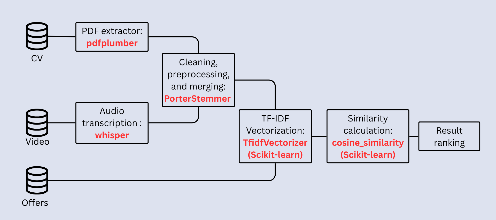

---

### 🧠 Approach 2: LLaMA 3-Based Semantic Matching

The second, more advanced approach uses a **local LLM (LLaMA 3)** to extract structured information from the candidate and job data, then performs semantic matching through prompting.

**Pipeline Overview:**

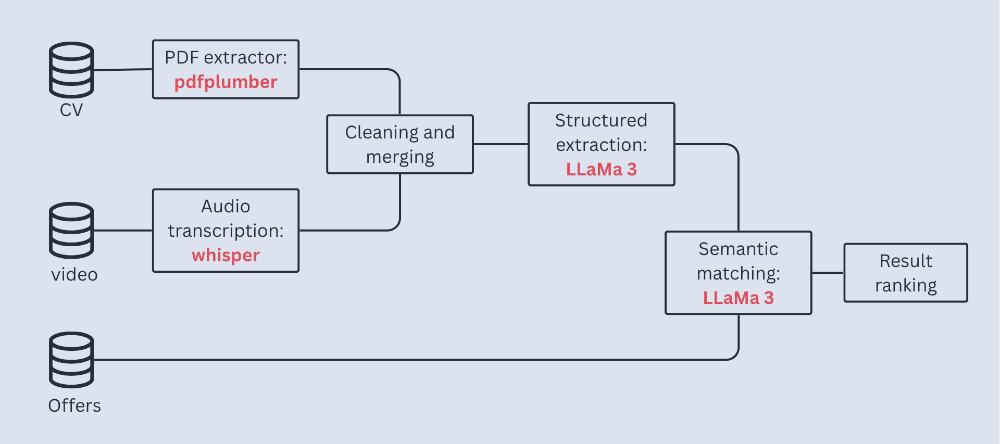

---

### ⚖️ Comparison: TF-IDF vs. LLaMA

| Criterion                    | TF-IDF                                  | LLM (LLaMA)                                  |
|-----------------------------|------------------------------------------|----------------------------------------------|
| Semantic precision          | Low                                      | High                                         |
| Match quality               | Medium                                   | Excellent                                    |
| Processing time             | Very fast                                | Slow                                         |
| CPU/memory usage            | Low                                      | High                                         |
| Scalability                 | Excellent with large datasets            | Limited                                      |
| Error tolerance             | Sensitive to typos                       | Tolerant to irregular or unstructured input  |
| Ease of implementation      | Easy (classic libraries)                 | Complex (LLM server, API, prompt design)     |
| Result consistency          | Stable                                   | May slightly vary (non-deterministic)        |
| Multilingual support        | Poor                                     | Excellent                                    |

---

## 🎙️ AI System – Phase 2: Interview Scoring

In the second phase of JobConnect’s AI pipeline, we focus on **evaluating interviews** by scoring each candidate using a combination of recruiter input and automated analysis tools.

To determine the most effective scoring method, we implemented and compared two different approaches:

---

### 🔁 Approach 1: Rule-Based Weighted Scoring

This approach uses a manually defined formula to compute a candidate's final score based on weighted components:

- **Manual form scores**:
    - Communication score
    - Technical score
    - Motivation score

- **AI-calculated scores**:
    - `notes_score`: sentiment analysis from recruiter comments (HuggingFace)
    - `video_score`: emotion analysis from the interview video (DeepFace)

**Weighted Formula** :
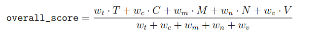
---

### 🤖 Approach 2: Machine Learning-Based Prediction

We trained regression models to **automatically predict the final interview score** based on the same input features:

- communication_score
- technical_score
- motivation_score
- notes_score
- video_score

#### Models tested:
- **Random Forest Regressor**
- **XGBoost Regressor**

Training was done on labeled interview data using Scikit-learn and XGBoost libraries.

---

### ⚖️ Comparison of Both Approaches

| Criteria                    | Weighted Model                           | ML-Based Model (Best: XGBoost)              |
|----------------------------|-------------------------------------------|---------------------------------------------|
| Ease of implementation     | ✅ Simple to implement                     | ❌ Requires data preparation & training      |
| Interpretability           | ✅ Transparent scoring                     | ❌ Black-box model (harder to explain)       |
| Adaptability               | ❌ Fixed weights                          | ✅ Learns patterns from data                 |
| Accuracy                   | ⚠️ Depends on well-tuned weights           | ⚠️ Depends on the quality of training data    |
| Handling noisy data        | ❌ Less robust                            | ✅ More robust if trained properly                     |

---
## 🧰 Tech Stack

### 🌐 Frontend
- **React.js** – Core frontend framework for building dynamic user interfaces
- **Tailwind CSS** – Utility-first CSS framework for responsive and modern styling
- **Axios** – Handles communication with backend APIs

### 🛠️ Backend
- **Node.js + Express.js** – REST API for authentication, job postings, applications, and data exchange
- **JWT** – Token-based authentication for securing routes and user sessions
- **Flask (Python)** – Lightweight server to expose AI and ML functionalities
- **MySQL** – Relational database for storing user profiles, job offers, applications, and interview data

### 🧠 Artificial Intelligence & Machine Learning
- **pdfplumber** – Extracts structured text from CVs (PDF format)
- **Whisper (OpenAI)** – Transcribes candidate pitch videos to text
- **NLTK (Porter Stemmer)** – Stemming and preprocessing for text normalization
- **scikit-learn** – Includes TF-IDF vectorization, cosine similarity, and baseline ML models
- **XGBoost** – Powerful gradient boosting regressor for interview scoring
- **HuggingFace Transformers** – Performs sentiment analysis on recruiter feedback
- **DeepFace** – Detects emotions in facial expressions during interviews
- **OpenCV** – Frame-level video analysis
- **Ollama + LLaMA 3** – Local LLM for semantic job matching and profile extraction
- **joblib** – Model saving and loading

### 🧪 Tools & Development Environment
- **Visual Studio Code** – Main code editor
- **Postman / Insomnia** – API testing tools
- **SQL Workbench** – Database management
- **Git & GitHub** – Version control and collaboration
- **dotenv** – Manage environment variables securely
---
## 🚀 Getting Started

### Prerequisites

- **Node.js**
- **Python 3.10+**
- **MySQL**
- **Ollama** installed locally for running LLaMA models
- Whisper and DeepFace models already downloaded

### 1. Clone the repository
```bash
git clone https://github.com/Moonflower1911/intelligent-recruitment-platform.git
cd intelligent-recruitment-platform
```
### 2. Backend Setup
#### Configure Backend Database Connection
Before running the backend, open the file ```server/config/config.json``` and update it with your local MySQL credentials:
```bash
{
  "development": {
    "username": "your_username",
    "password": "your_password",
    "database": "your_database_name",
    "host": "localhost",
    "dialect": "mysql"
  }
}
```
Also, create a .env file in the server/ directory:
```
DB_HOST=localhost
DB_USER=your_username
DB_PASS=your_password
DB_NAME=your_database_name
LLAMA_MODEL=llama3
```
This .env file is used by the Python scripts.

#### 📂 Create Upload Directories (Required)

Before running the backend, make sure the following folders exist:
```
server/uploads/
├── cvs/
└── interviews/
```
If they don't exist, create them manually:
```bash
mkdir -p server/uploads/cvs
mkdir -p server/uploads/interviews
```
and then run the backend:

```bash
cd server
npm install
npm run dev
```
### 3. Frontend Setup

```bash
cd client
npm install
npm start
```
### 4. Python AI Services
```bash
cd server/scripts_python
python -m venv venv
venv\Scripts\activate   # On Windows
# or: source venv/bin/activate   # On Linux/macOS
pip install -r requirements.txt
```

#### ▶️ Phase 1: Pre-Interview Matching 

Run one of the following depending on the method:
```bash
# TF-IDF based matching
python phase1/tf-idf.py
```
```bash
# LLaMA-based semantic matching
python phase1/llama_local.py
```
#### ▶️ Phase 2: Interview Scoring

You can choose between the two methods:
```bash
# Rule-based weighted scoring
python phase2/weighted_score.py
```
```bash
# First, train the model
python phase2/ml/train_model.py

# Then run the scoring system
python phase2/ml/ml.py
```

## 📸 Screenshots

### Landing Page
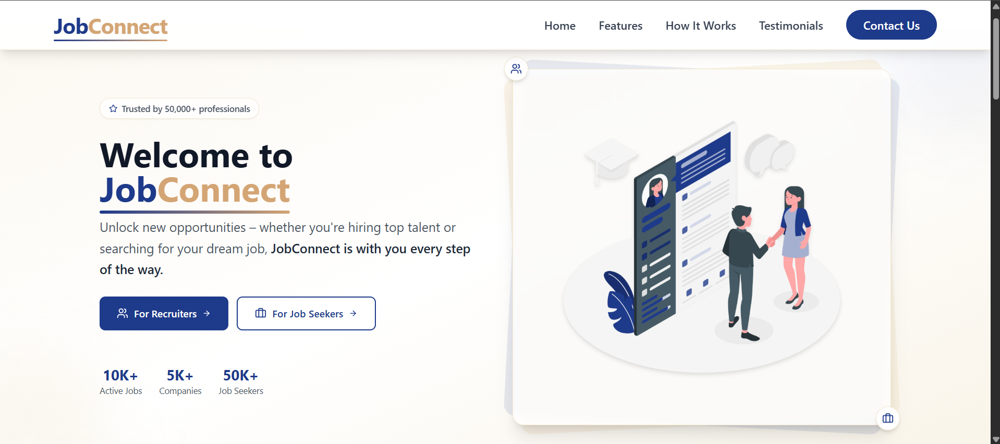  
Landing Page: Welcome page with access to recruiter or job seeker sections and platform overview.  
<br>

  
Sign-Up Page: Enables new users to create a job seeker or recruiter account.  
<br>

  
Login Page: Allows registered users to securely sign in to their account.  
<br>

### Jobseeker space
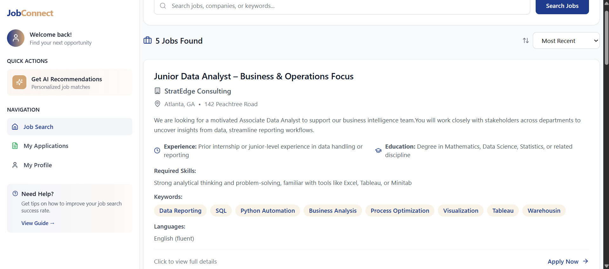  
Job Seeker Home: Main dashboard to browse job offers, navigate via sidebar, and access AI-based recommendations.  
<br>

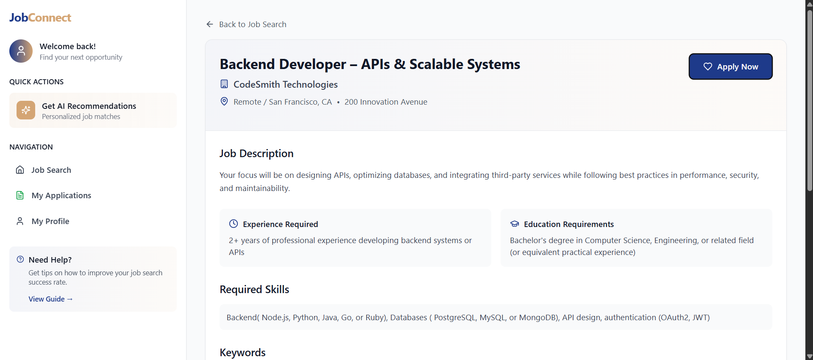  
Job Offer Detail: Detailed view of a job posting with option to apply (if a CV is uploaded) or withdraw an existing application.  
<br>

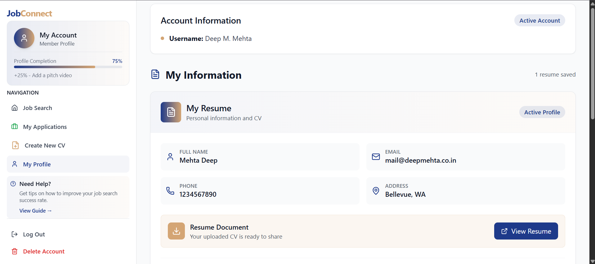  
Account Page: Displays personal details, CV, and optional pitch video. Shows profile completion status.  
<br>

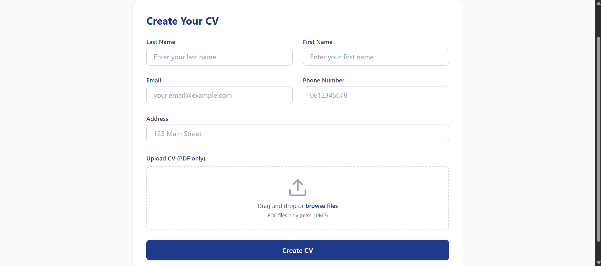  
CV Creation Form: Form to enter personal information and upload a CV (PDF format) to enable job applications.  
<br>

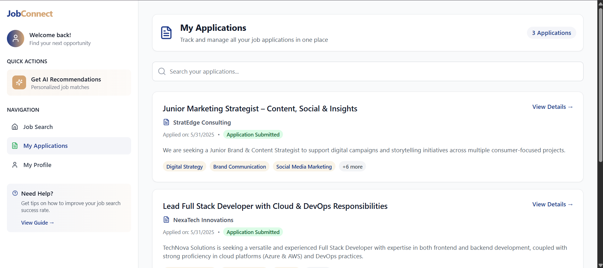  
My Applications: Overview of all submitted job applications with status and filtering options.  
<br>

### Recruiter space
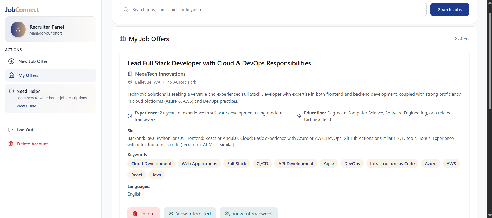  
Recruiter Home: Dashboard showing all published job offers with access to manage or delete them.  
<br>

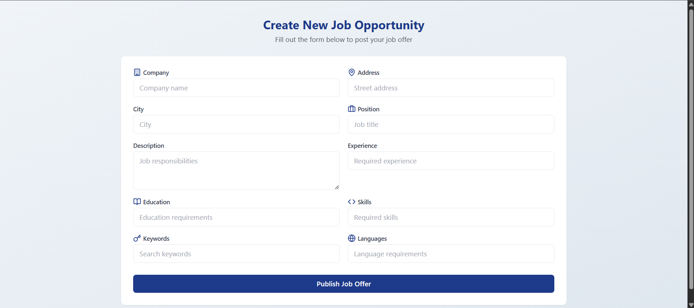  
Job Offer Form: Form to create a new job listing by entering required details such as role, skills, and qualifications.  
<br>

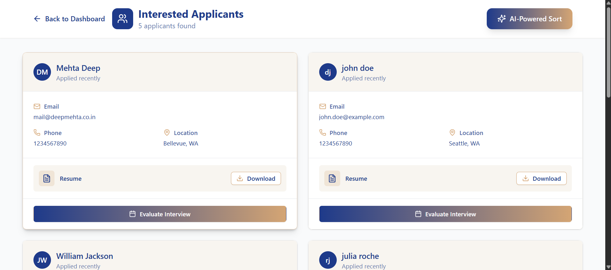  
Interested Applicants: Displays candidates who applied to an offer. Recruiter can sort them by relevance using AI.  
<br>

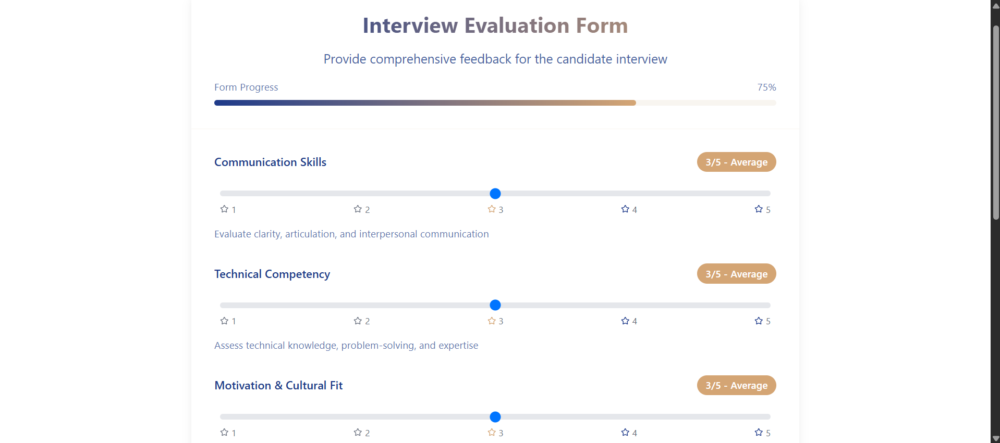  
Interview Evaluation Form: Used by recruiters to assess candidates' communication, technical skills, and motivation. Includes note field and optional video upload.  
<br>

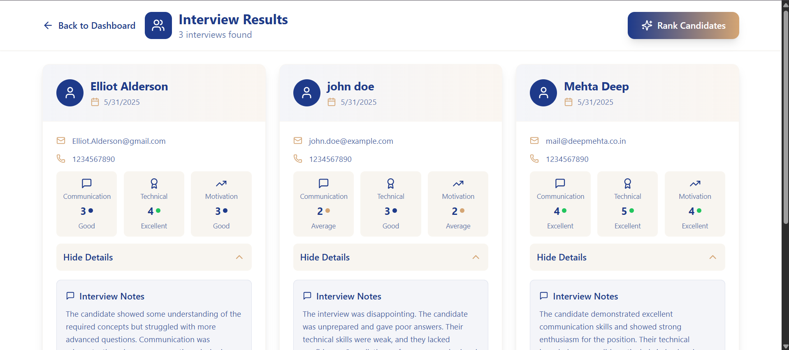  
Interview Results: Ranked list of interviewees based on AI-calculated scores (notes, video, and overall fit) to assist in final decision-making.  
<br>

## 📁 Project Structure
```
intelligent-recruitment-platform/
├── assets/                      # Screenshots and diagrams for README
├── client/                      # React + Tailwind CSS frontend
│   ├── public/                  # Static files and assets
│   └── src/                     # Main React components and views
│
├── server/                      # Node.js + Express backend
│   ├── config/                  # Database config (config.json)
│   ├── middlewares/            # Custom Express middlewares
│   ├── models/                  # Sequelize models
│   ├── routes/                  # API route handlers
│   ├── uploads/                 # Uploaded files
│   │   ├── cvs/                 # CV PDF uploads + Pitch video uploads
│   │   └── interviews/          # Interview video uploads
│   ├── scripts_python/          # AI modules (Flask + ML)
│   │   ├── phase1/              # Phase 1: Pre-interview matching
│   │   │   ├── tf-idf.py
│   │   │   └── llama_local.py
│   │   ├── phase2/              # Phase 2: Interview scoring
│   │   │   ├── weighted_score.py
│   │   │   └── ml/
│   │   │       ├── train_model.py
│   │   │       └── ml.py
│   │   └── requirements.txt     # Python dependencies
│   └── .env                     # Environment file used by Python scripts
│
└── README.md
```

## 👥 Authors

- **Meryem Elfadili**
- **Salma Azize**

